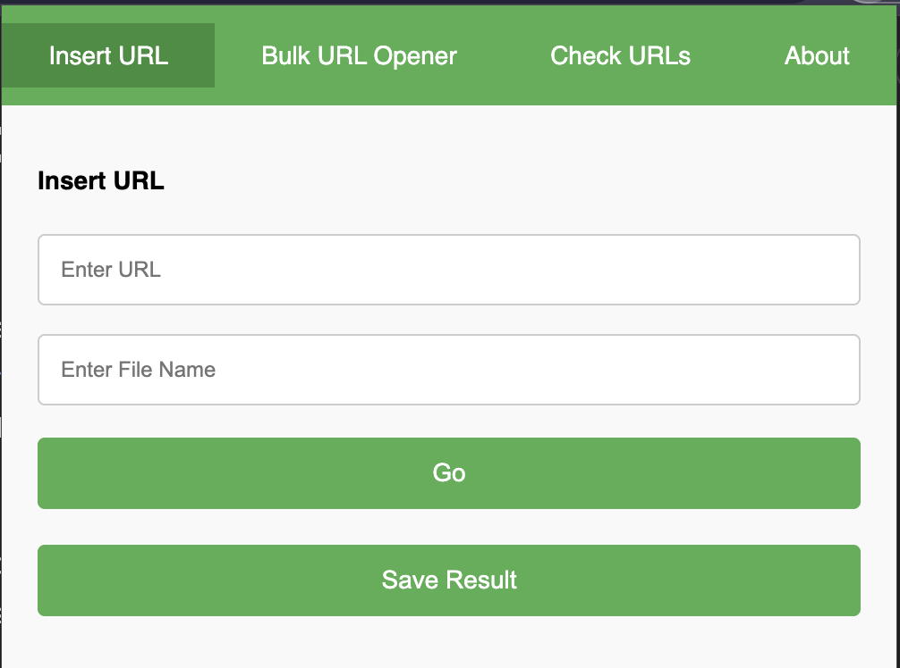

<p align="center">

</p>

# Smile - Web Application Hacking & Bug Hunting Assistant

**Smile** is a powerful Chrome extension designed to assist web application hackers and bug hunters in their workflow. It integrates with the [Internet Archive](https://archive.org/web/), offering features such as bulk URL checks, URL insertion into the Wayback Machine, and bulk URL opening using HTTP or HTTPS protocols. 

This extension provides essential tools for security researchers, helping them explore historical versions of websites, validate URL status, and streamline their bug hunting process. With an easy-to-use interface and additional support for social media interaction and donations, **Smile** is the perfect assistant for your bug hunting endeavors.
  
## Screenshots



## Installation

1. Clone or download this repository.

```bash
git clone https://github.com/smile/web-archive-extension.git
```

2. Open Chrome, then navigate to the following URL:

```
chrome://extensions/
```

3. Enable **Developer Mode** in the top right corner of the page.

4. Click on **Load unpacked** and select the project folder (where `manifest.json` is located).

5. The extension will now appear in your browser's extensions list.

## Usage

### 1. **Insert URL**
- In the **Insert URL** tab, simply enter the URL you want to archive and press the "Go" button.
- You can also enter a file name for the result and click "Save Result" to download the archived URL data.

### 2. **Check URLs**
- In the **Check URLs** tab, paste a list of URLs (one per line) and click "Check URLs".
- The extension will check if each URL exists and show the status code (200, 404, etc.) in a table.
- Pagination is provided for better navigation if you are working with a large number of URLs.

### 3. **Bulk URL Opener**
- In the **Bulk URL Opener** tab, paste a list of URLs (one per line).
- Select the protocol you'd like to use (`HTTP`, `HTTPS`, or both).
- Click "Open URLs" to open each URL in a new tab with the selected protocol.

### 4. **About**
- In the **About** tab, you'll find clickable links to the developer's Twitter, GitHub, and website.
- There is also an option to donate via cryptocurrency using the provided wallet address.

## Example Usage

### 1. Inserting a URL into Web Archive:
- Enter the URL (e.g., `https://example.com`) in the **Insert URL** tab.
- Click on **Go** to open the archive link in a new tab.

### 2. Checking URLs:
- Paste the following URLs in the **Check URLs** tab:
  ```
  https://example.com
  https://another-example.com
  https://nonexistent-url.com
  ```
- Click **Check URLs** to see the status codes (200 for active, 404 for not found).

### 3. Bulk Opening URLs:
- Paste a list of URLs in the **Bulk URL Opener** tab.
  ```
  example.com
  another-example.com
  ```
- Check either `HTTP` or `HTTPS` (or both) and click **Open URLs** to open each URL in a new tab.

## Contribution

1. Fork this repository.
2. Create a new branch (`git checkout -b feature-branch`).
3. Commit your changes (`git commit -m 'Add a feature'`).
4. Push to the branch (`git push origin feature-branch`).
5. Open a Pull Request.

## License

This project is licensed under the **GNU General Public License v3.0**. You are free to copy, modify, and distribute this software under the following conditions:

- The source code must be made available when the software is distributed.
- Any modifications must also be licensed under GPLv3.
- You must include a copy of the license in any distribution.

For more information, refer to the full [GPLv3 License](https://www.gnu.org/licenses/gpl-3.0.en.html).

## Author

- **[intruXpert]** - Developer and Maintainer
- **Twitter**: [@intruXpert](https://x.com/intruXpert)
- **GitHub**: [@intruXpert](https://github.com/intruXpert)
- **Website**: [intruXpert.com](https://intruXpert.com)

